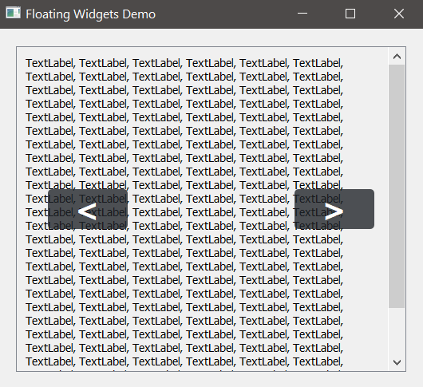

# floating_demo
This one shows off **layered** layouts or floating widgets on top of each other by using `QGridLayout`.

All widgets are layed out in Designer side by side and then in code we stack the cells on top of each other. Voilà!:
Here you see styled buttons on top of an underlying scroll area with a text label:

> 

The background layer can also be animated but be aware: Transparency does NOT work on top of these!
Here the buttons use the SAME stylesheet :/

> 
